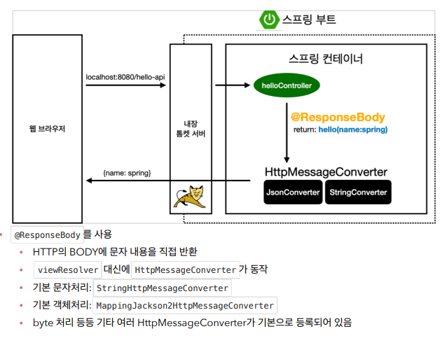

인프런 강의 < [스프링 입문 - 코드로 배우는 스프링 부트, 웹 MVC, DB 접근 기술](https://www.inflearn.com/course/%EC%8A%A4%ED%94%84%EB%A7%81-%EC%9E%85%EB%AC%B8-%EC%8A%A4%ED%94%84%EB%A7%81%EB%B6%80%ED%8A%B8) > 정리

---

## 정적 컨텐츠
```html
<!DOCTYPE HTML>
<html>
<head>
 <title>static content</title>
 <meta http-equiv="Content-Type" content="text/html; charset=UTF-8" />
</head>
<body>
정적 컨텐츠 입니다.
</body>
</html>
```

1. 웹 브라우저에서 `http://localhost:8080/hello-static.html` 검색
2. `Tomcat`에서 요청을 받음
3. `controller`가 존재하지 않는 것을 판단
4. `resources`내에 있는 hello-static.html을 찾고 존재하면 반환

## MVC와 템플릿 엔진
- MVC: Model, View, Controller
    - View: 화면 구성에 집중
    - Controller: 비지니스 logic, 내부적인 일들을 처리에 집중

Controller
```java
@Controller
public class HelloController {
    @GetMapping("hello-mvc")
    public String helloMvc(@RequestParam("name") String name, Model model) {
        model.addAttribute("name", name);
        return "hello-template";
    }
}
```
View
```html
<html xmlns:th="http://www.thymeleaf.org">
<body>
<p th:text="'hello ' + ${name}">hello! empty</p>
</body>
</html>
```
- 실행: http://localhost:8080/hello-mvc?name=spring


1. 웹 브라우저에서 localhost:8080/hello-mvc 넘긴다.
2. `Tomcat`에서는 hello-mvc에 Mapping되어 있는 Controller 존재를 찾음
3. 스프링은 해당 method를 호출하고 return값과 key값을 View로 넘김
4. viewResolver가 Thymeleaf 템플릿 엔진에 처리 해달라고 넘김

## API
### 일반 ResponseBody
```java
@Controller
public class HelloController {
    @GetMapping("hello-string")
    @ResponseBody
    public String helloString(@RequestParam("name") String name) {
        return "hello " + name;
    }
}
```
`@ResponsBody`는 HTTP의 body에 직접 데이터를 내려주는 것을 말한다
- view 사용 x
- 웹페이지를 `페이지 소스보기로`로 확인해보면 `html` 형식이 아님
- 실행: http://localhost:8080/hello-mvc?name=spring

### 객체로 Return하는 ResponseBody
```java
@Controller
public class HelloController {
    @GetMapping("hello-api")
    @ResponseBody
    public Hello helloApi(@RequestParam("name") String name) {
        Hello hello = new Hello();
        hello.setName(name);
        return hello;
    }
    static class Hello {
        private String name;
        public String getName() {
        return name;
        }
        public void setName(String name) {
        this.name = name;
        }
    }
}
```
- 실행: http://localhost:8080/hello-api?name=spring
- 결과: `json`형식(`key, value 구조`)으로 나옴
```html
{"name":"spring!!"}
```




---
< 자료 출처: [스프링 입문 - 코드로 배우는 스프링 부트, 웹 MVC, DB 접근 기술](https://www.inflearn.com/course/%EC%8A%A4%ED%94%84%EB%A7%81-%EC%9E%85%EB%AC%B8-%EC%8A%A4%ED%94%84%EB%A7%81%EB%B6%80%ED%8A%B8) >