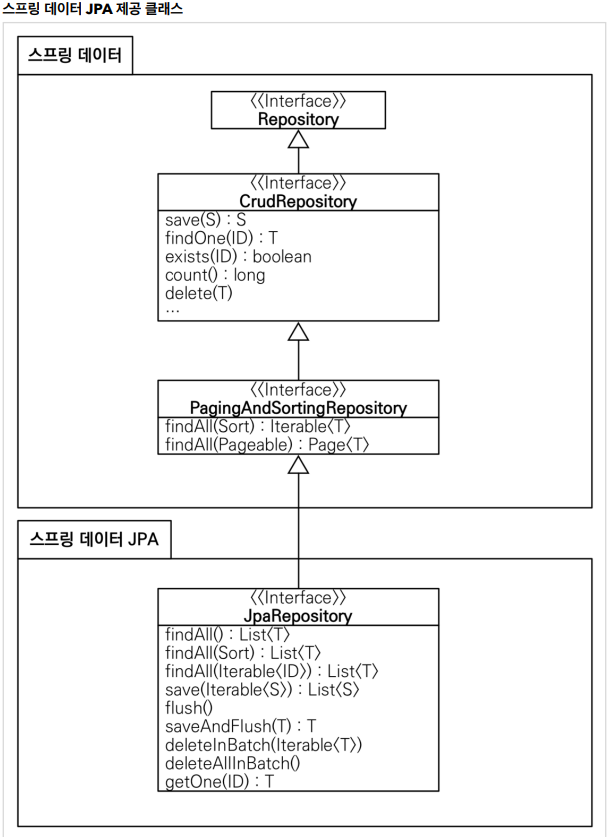
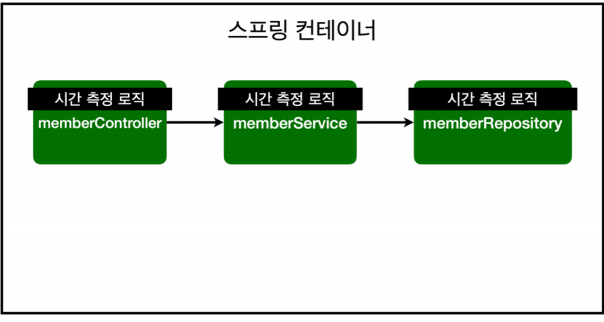
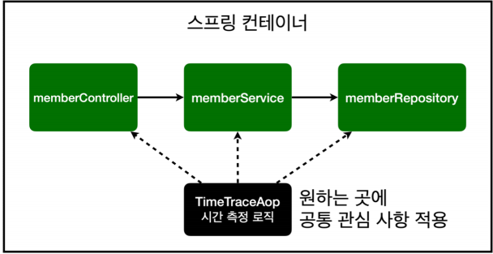

인프런 강의 < [스프링 입문 - 코드로 배우는 스프링 부트, 웹 MVC, DB 접근 기술](https://www.inflearn.com/course/%EC%8A%A4%ED%94%84%EB%A7%81-%EC%9E%85%EB%AC%B8-%EC%8A%A4%ED%94%84%EB%A7%81%EB%B6%80%ED%8A%B8) > 정리

---
## 테이블 생성
```sql
drop table if exists member CASCADE;
create table member
(
 id bigint generated by default as identity,
 name varchar(255),
 primary key (id)
);
```

java에서 Long 타입은 big int

generated by default as identity는 id값이 입력되지 않고 name만 입력되었을때 자동으로 채워 주는 기능

## 스프링 통합 테스트
- 단위테스트가 더 빠르다.
- 통합 테스트는 DB까지 통합해서 하는 테스트라서 조금 느리다.

```java
@SpringBootTest
@Transactional
class MemberServiceIntegrationTest {
    @Autowired
    MemberService memberService;
    @Autowired
    MemberRepository memberRepository;

    @Test
    public void 회원가입() throws Exception {
        //Given
        Member member = new Member();
        member.setName("hello");
        //When
        Long saveId = memberService.join(member);
        //Then
        Member findMember = memberRepository.findById(saveId).get();
        assertEquals(member.getName(), findMember.getName());
    }

    @Test
    public void 중복_회원_예외() throws Exception {
        //Given
        Member member1 = new Member();
        member1.setName("spring");
        Member member2 = new Member();
        member2.setName("spring");
        //When
        memberService.join(member1);
        IllegalStateException e = assertThrows(IllegalStateException.class,
                () -> memberService.join(member2));//예외가 발생해야 한다.
        assertThat(e.getMessage()).isEqualTo("이미 존재하는 회원입니다.");
    }
}
```
`@SpringBootTest`: 스프링 컨테이너와 함께 테스트 실행한다.

`@Transactional`: 위에서 테스트를 반복 수행하면 spring이란 네임이 이미 저장되어있기 때문에 안된다. Transactional가 해당 오류를 없애기 위해 테스트 완료 후에 롤백한다.

## JPA

- JPA는 기존의 반복 코드와, 기본적인 SQL도 JPA가 직접 만들어서 실행
    - Jdbc는 SQL을 직접 생성해야 함
- JPA는 SQL, 데이터 중심 설계에서 객체 중심의 설계로 패러다임 전환이 가능
- JPA는 생산성을 높인다.

```java
@Entity
public class Member {
    @Id
    @GeneratedValue(strategy = GenerationType.IDENTITY)
    private Long id;
    private String name;

    public Long getId() {
        return id;
    }

    public void setId(Long id) {
        this.id = id;
    }

    public String getName() {
        return name;
    }

    public void setName(String name) {
        this.name = name;
    }
}
```
- `Entity`는 객체, 관계형 데이터베이스를 묶어주는 어노테이션

- `IDENTITY` DB가 알아서 생성해주는것

```java
public class JpaMemberRepository implements MemberRepository {
    
    private final EntityManager em;

    public JpaMemberRepository(EntityManager em) {
        this.em = em;
    }

    @Override
    public Member save(Member member) {
        return null;
    }

    @Override
    public Optional<Member> findById(Long id) {
        return Optional.empty();
    }

    @Override
    public Optional<Member> findByName(String name) {
        return Optional.empty();
    }

    @Override
    public List<Member> findAll() {
        return null;
    }
}
```
- JPA는 `EntityMananger`에 의해서 동작함.
    - gradle에 추가한 data-jpa에서 `EntitiyManager`를 생성함
    - 만들어진 것을 injection 받음


- 모든 데이터 변경은 `@Transactional`안에서 실행되어야 함.
    - EX) `service` 디렉토리의 회원가입 같은 기능들
- 스프링은 해당 클래스의 메서드를 실행할때 트랜잭션을 실행하고, 정상 종료되면 트랜잭션을 커밋함


## 스프링 데이터 JPA

```java
@Configuration
public class SpringConfig {

    private final MemberRepository memberRepository;

    @Autowired
    public SpringConfig(MemberRepository memberRepository) {
        this.memberRepository = memberRepository;
    }
}
```


```java
public interface SpringDataJpaMemberRepository extends JpaRepository<Member, Long>, MemberRepository {

    @Override
    Optional<Member> findByName(String name);
}
```

- 컨테이너에서 MemberRepository를 찾는다.
- `JpaRepository`를 import만 해놓으면 스프링 데이터 JPA가 인터페이스에 대한 구현체를 스스로 만든다.
- 그 후에 `@Bean`에 등록한다.



- CRUD 제공
- 페이징 기능
- 위 그림에서 제공하는 기능 표시
- ✨**이름이나 이메일 같은 것들을 설정하는 것은 공통레벨이 아님!!! 따라서 따로 설정해야됨.**

## AOP(간단한 개념)
### AOP 필요한 상황
- 메소드 호출 시간 측정하고 싶을때 - (여러 시간 기준: sec, msec)
     - `System.out.currentTimeMillis()` 을 각 메소드에 넣어서 하기에는 힘듦.
---
### AOP 적용 원리





```java
@Component
@Aspect
public class TimeTraceAop {
    @Around("execution(* hello.hellospring..*(..))") // 적용 시킬 곳을 타겟팅 함.
    public Object execute(ProceedingJoinPoint joinPoint) throws Throwable {
        long start = System.currentTimeMillis();
        System.out.println("START: " + joinPoint.toString());
        try {
            return joinPoint.proceed();
        } finally {
            long finish = System.currentTimeMillis();
            long timeMs = finish - start;
            System.out.println("END: " + joinPoint.toString() + " " + timeMs +
                    "ms");
        }
    }
}
```
- 다음과 같이 공통사항은 AOP를 적용해서 모든 메소드에 적용 시키도록 한다.


- 가짜 스프링 bean을 앞에 두고 `joinPoint.proceed()` 실행하면 실제 bean 실행.
- `joinPoint`관련 여러가지 메소드 사용할 수 있음.

---
< 자료 출처: [스프링 입문 - 코드로 배우는 스프링 부트, 웹 MVC, DB 접근 기술](https://www.inflearn.com/course/%EC%8A%A4%ED%94%84%EB%A7%81-%EC%9E%85%EB%AC%B8-%EC%8A%A4%ED%94%84%EB%A7%81%EB%B6%80%ED%8A%B8) >