인프런 강의 < [모든 개발자를 위한 HTTP 웹 기본 지식](https://www.inflearn.com/course/http-%EC%9B%B9-%EB%84%A4%ED%8A%B8%EC%9B%8C%ED%81%AC/dashboard) > 정리

---

## IP

- 인터넷에 연결되어 있는 모든 장치를 식별할 수 있도록 각각에 부여된 고유 주소
- 패킷단위로 데이터를 전달한다.

#### 패킷
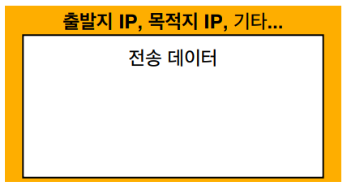

#### 클라이언트 패킷 전달
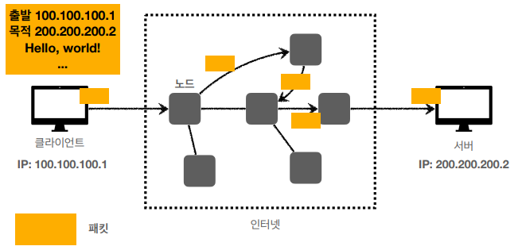

#### 서버 패킷 전달
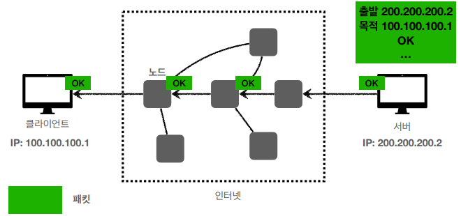

### 한계
- 비연결성: 패킷을 받을 대상이 없거나 서비스 불능 상태여도 패킷 전송
- 비신뢰성: 패킷이 정상적으로 수신될 지 안될 지 확신할 수 없다.
    - loss, order
- 동일한 서버와 통신하는 장치가 두개 이상일때, 두개를 구분할 수 없다.

## TCP, UDP

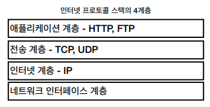
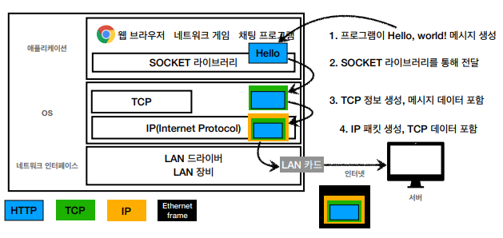
- encapsulation
### TCP 특징
- 연결지향(connection - oriented): 3 way handshake
    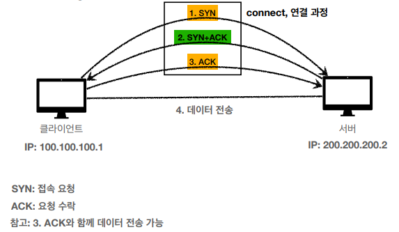
- 신뢰적
    - 데이터 전달 보증
    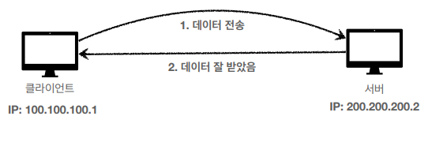

    - 순서 보장
    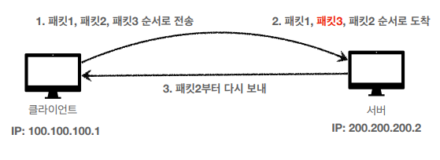

### UDP 특징
- 연결지향 x (connectionless)
- 비신뢰적
    - 데이터 전달 보증 x
    - 순서 보장 x
- 3 way handshake 과정이 없기때문에 전송은 빠르고 단순함
- IP와 다르게 장치를 구분하기 위해 port 번호와 오류를 검증하는 체크섬이 추가됨

## PORT

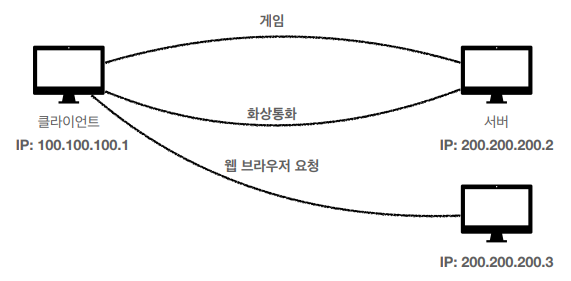
- 다음과 같이 하나의 서버에서 두개 이상의 패킷을 받을때 해당 패킷이 어떤 요청에 의한 패킷인지 구분할 수 없다.

#### 비유
- IP가 아파트라고 하면 PORT는 동, 호수라고 할 수 있다.

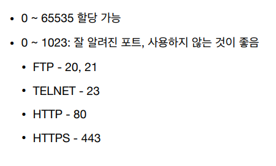

## DNS
- IP는 기억하기 어렵고, 변경 가능성이 존재한다.
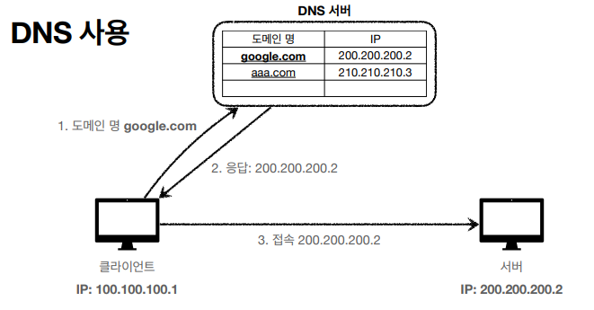

- 클라이언트가 원하는 도메인 주소를 입력하면 DNS서버에서 해당 도메인 주소와 매핑된 IP주소를 응답으로 보내준다.
- 만약 IP주소가 변경이 된다면 DNS서버내에서 도메인에 맞게 변경함

#### Recursive 쿼리
#### Iterative 쿼리

---

< 자료 출처: [모든 개발자를 위한 HTTP 웹 기본 지식](https://www.inflearn.com/course/http-%EC%9B%B9-%EB%84%A4%ED%8A%B8%EC%9B%8C%ED%81%AC/dashboard) >