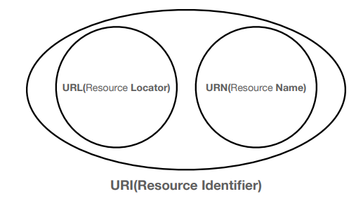
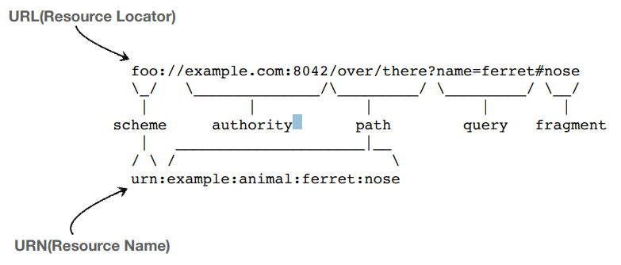
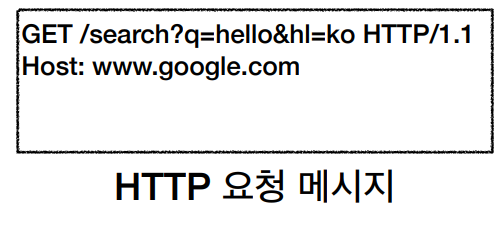
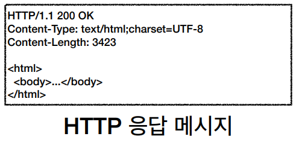

인프런 강의 < [모든 개발자를 위한 HTTP 웹 기본 지식](https://www.inflearn.com/course/http-%EC%9B%B9-%EB%84%A4%ED%8A%B8%EC%9B%8C%ED%81%AC/dashboard) > 정리

---

## URI
- Locator, name으로 리소스를 식별한다.

### URL
- 리소스가 있는 위치를 지정

### URN
- 리소스에 이름을 부여

## URL의 문법

### scheme

- 스키마는 보통 프로토콜을 말한다.
- 프로토콜은 자원에 접근할 방식을 정하는 규칙이다.

### userinfo

- 사용자 정보가 입력되는 곳이지만 사용되지 않음

### host

- 호스트명
- 도메인명을 넣는 곳

### port

- 접속 포트
- 보통 생략하며 http는 80 https는 443으로 정해져있다.

### path

- 리소스 경로이며 계층적 구조로 되어있다.

### query

- key = value의 형태
- ?부터 쿼리가 시작되며, 추가할 내용은 &를 사용해서 추가한다.
- 쿼리는 모두 문자열 형태로 파라미터가 넘어간다.

### fragment

- html 내내 북마크 등에 사용
- 서버로 전송되는 정보는 아님

## 웹 브라우저 요청 흐름
1. `https://www.google.com/search?q=hello&hl=ko` 을 검색
2. DNS 서버에서 해당 도메인 명에 매핑된 IP주소를 검색
3. `https`는 포트 번호 443을 사용
4. 해당 내용을 바탕으로 HTTP 요청 메시지 생성
    
    
5. 해당 HTTP 요청 메시지는 TCP/IP 패킷내부에 `Encapsulation` 되어 서버로 넘어간다
6. 서버에서는 해당 패킷을 `Decapsulation` 해서 TCP/IP 껍데기는 버리고 해당 HTTP 메시지를 해석한다.
7. 브라우저로 HTTP 응답 메시지를 보낸다
    

8. HTTP 응답 메시지의 html 메시지를 웹 브라우저에서 렌더링 한다.

---

< 자료 출처: [모든 개발자를 위한 HTTP 웹 기본 지식](https://www.inflearn.com/course/http-%EC%9B%B9-%EB%84%A4%ED%8A%B8%EC%9B%8C%ED%81%AC/dashboard) >