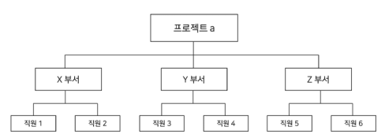
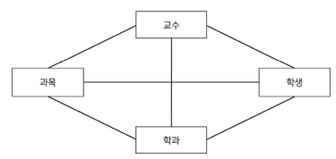
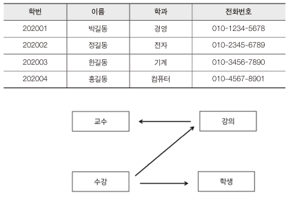
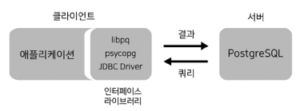
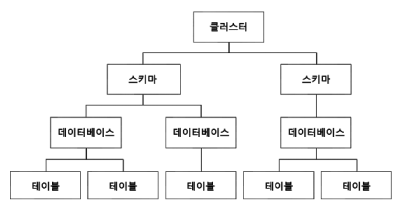
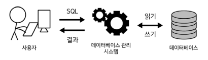

< 모두를 위한 PostgreSQL >을 공부하고 정리 했습니다. 

---

## 데이터베이스란
> 논리적으로 연관된 데이터들을 체계화해서 여러 사람이 공유하여 사용할 목적으로 통한한 것

### 데이터의 종류
- 통합 데이터
> 데이터들이 모여있으면 중복되는 데이터들이 존재하는데 이 데이터들을 통합하여 중복되는 데이터를 줄인다.

- 저장 데이터
> 컴퓨터 내부에 저장되어 있는 데이터를

- 운영 데이터
> 조직은 운영하는데 도움이 되는 데이터

- 공유 데이터
> 공동의 필요에 의해 저장되는 데이터

### 데이터베이스의 특징
- 실시간 접근성
> 비정형적인 조회에 대해서 실시간 처리에 의한 응답이 가능해야 한다.

- 지속적인 변화
> 데이터베이스는 동적인 특징을 지닌다. 따라서 삽입, 삭제, 갱신으로 항상 최신 데이터를 유지해야 한다.

- 동시 공유
> 다수의 사용자가 동시에 같은 내용의 데이터를 이용할 수 있어야 한다.

- 내용에 따른 참조
> 데이터를 참조할 때, 사욪아가 요구하는 데잍 내용을 찾는다.

## 데이터베이스 관리 시스템(DBMS)
- DBMS는 정의, 조작, 제어 세가지 기능은 갖는다.

#### 정의
> 응용 프로그램이 요구하는 데이터베이스 구조를 지원하고 생성, 변경, 제거할 수 있다. - 테이블 조작

#### 조작
> 데이터베이스에 접근하여 사용자가 요구하는 데이터를 삽입, 갱신, 삭제 할 수 있다.

#### 제어
> 데이터베이스의 접근할 수 있는 사용자를 제한하고 성능을 관리한다.

## 데이터베이스 모델
### 계층형 데이터베이스
- 데이터를 계층에 따라 조직화한 데이터베이스

### 네트워크형 데이터베이스
- 다대다 관계를 표현하여 계층형 데이터베이스의 단점을 보완

### 관계형 데이터베이스(RDB)
- 데이터를 행과 열로 구분하는 2차원 테이블 형태
- 각각의 테이블은 관계가 존재하며, 재구성하지 않고도 데이터에 다양한 방식으로 접근 가능
- SQL을 사용하여 데이터를 처리한다.

### NoSQL
- 기존 관계형 데이터베이스의 단점을 보완하여 성능을 높여 생산성이 증가한다.
- 안정성이 조금 떨어진다.

## PostgreSQL 기능과 성능
#### 트랜잭션
- RDBMS 작업의 단위인 트랜잭션과 트랜잭션의 안전한 수행을 위한 MVCC, ACID라는 속성을 지원한다.
- 쉽게 말해, 대용량의 복잡한 연산 처리를 안전하게 해낼 수 있다.

#### 확장성, 다양한 플랫폼
- 사용자 정의 함수, 연산자 등 다양한 사용자 정의 객체를 지원한다.
- 다양한 플랫폼에서 사용이 가능하다.

## PostgreSQL의 구조
### 프로세스 구조

- 프로세스 구조는 클라이언트-서버 모델을 기반으로 한다.
- 클라이언트는 수요자, 서버는 공급자를 의미하며 연결되어 있어야한다.
- 수요자는 요청한 대로 데이터베이스를 조작한 결과값을 받아내고, 공급자는 수요자의 요청에 따라 데이터베이스를 조작한 값을 내보내는 역할을 한다.

### 계층 구조

#### 클러스터
- 클러스터는 데이터베이스들의 집합이다.
- 클러스터는 서버 내에서 이름으로 식별할 수 없다.
- 데이터베이스의 상위 개념

#### 스키마
- 개체들의 논리적인 집합

##### 구성
- 테이블
- 뷰
- 함수
- 인덱스
- 데이터 타입
- 연산자

- 스키마는 각각의 이름으로 식별이 가능하므로 같은 이름으로 할 수 없다.
- PostgreSQL은 테이블의 집합을 스키마의 개념으로 사용한다.
- MySQL은 테이블의 집합이 데이터베이스가 되지만 PostgreSQL은 스키마들의 집합이 데이터베이스가 된다.

#### 테이블
- 테이블은 row, column으로 이루어져 있다.
- row에는 개체를 식별할 수 있는 key가 존재한다.
- column에는 컬럼명의 특성을 가지는 데이터 값들이 저장된다.

## SQL이란?
- 데이터베이스에 접근하여 데이터를 다루기 위한 전용 언어를 `구조화된 질의 언어`, 즉 `SQL(Structured Query Language)`라고 한다.
- SQL은 원하는 결과만 입력하면 RDBMS가 알아서 결과값을 내주므로 `비절차적 언어`라고도 한다.

- SQL을 RDBMS에 보내고, RDBMS는 우리가 보낸 SQL을 해석하여 데이터베이스에서 데이터를 가져오거나 조작한다.

### SQL의 유형
#### 데이터 정의어(Data Definition Language)
- 테이블, 뷰, 인덱스, 함수 등 다른 데이터베이스 객체들을 정의, 변경, 제거 등 객체관리에 사용하는 SQL을 `DDL`이라고 한다.
- CREATE, ALTER, DROP, RENAME, TRUNCATE 등이 있다.

#### 데이터 조작어(Data Manipulation Language)
- `DML`은 테이블 내의 데이터를 갱신, 삭제하거나 새로운 데이터를 추가, 저장하는 등 데이터를 조작하는 SQL
- SELECT, INSERT, DELETE, UPDATE 등이 있다.

#### 데이터 제어어(Data Control Language)
- `DCL`은 데이터베이스에 접근하거나 권한을 부여하는 역할을 하는 SQL
- 데이터베이스를 보호하는 역할
- GRANT, REVOKE 등이 있다.

---

< 자료 출처: [모두를 위한 PostgreSQL](https://bjpublic.tistory.com/394) >