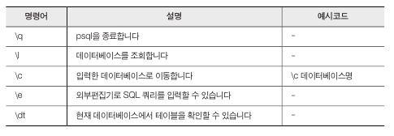
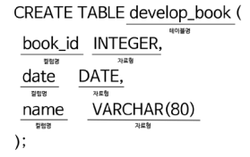
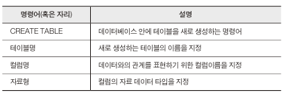
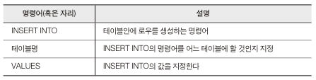
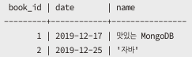
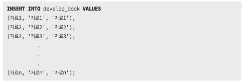
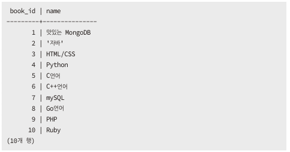
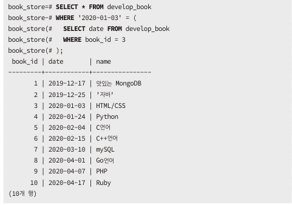
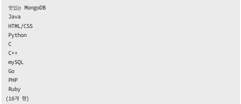

< 모두를 위한 PostgreSQL >을 공부하고 정리 했습니다. 

---

## SQL Shell 명령어


## 데이터베이스 생성
```sql
CREATE DATABASE book_store;
```
- `book_store`라는 데이터베이스 생성
- `\l` 명령어를 이용해서 생성한 데이터베이스 조회 가능
- `\c book_store` 명령어를 이용해서 생성한 데이터베이슬 접속
- 접속이 되면 `book_store=#` 으로 나옴

## 데이터베이스 삭제
```sql
DROP DATABASE 데이터베이스명;
```
- 현재 접속중인 데이터베이스는 삭제할 수 없다.

## 테이블 생성



- VARCHAR(80)은 80자 이하의 문자의 형태를 의미한다.

## 테이블 삭제
```sql
DROP TABLE 테이블명;
```

## 데이터 추가하기

### 순서 지정 없이 데이터 자료 추가
```sql
INSERT INTO 테이블명 VALUES(book_id, date, name);
```


- 컬럼수에 맞게 데이터를 넣어야 한다.


- 다음에 두번째 데이터처럼 자바를 따옴표 사이에 넣으려면 작은 따옴표 두개로 감싸주면 된다.

### 순서 지정하고 데이터 자료 추가
```
INSERT INTO develop_book (컬럼1, 컬럼2, 컬럼3) VALUES
(컬럼1에 데이터1, '컬럼2에 데이터2', '컬럼3에 데이터3');
```
- 아래와 같이 컬럼의 순서는 변경되어도 된다
```
INSERT INTO develop_book (date, book_id, name) VALUES
('2020-01-03', 3, 'HTML/CSS');
```
### 테이블에 자료 여러 개 추가하기
- `,`으로 구분해서 넣어준다.


## 데이터 조회하기

|명령어|설명|
|--|--|
|SELECT|칼럼을 지정한다.|
|*|모든 칼럼을 의미한다.|
|FROM|테이블을 지정한다.|
```
SELECT * FROM develop_book;
```

### 선택한 자료 조회하기
```
SELECT book_id, name FROM develop_book;
```

### 데이터 조회 명령어
|명령어|설명|
|--|--|
|LIMIT|반환하는 로우의 개수를 지정|
|OFFSET|반환하는 로우의 시작지점을 지정|
|ORDER BY|반환하는 로으를 정렬할 떄 사용|
|WHERE|지정한 로우만 조회가 되도록 필터 기능|

#### LIMIT
```
SELECT * FROM develop_book
LIMIT 5;
```
- 여러개의 로우중 5개의 로우만 출력한다.

#### OFFSET
```
SELECT * FROM develop_book
LIMIT 5;
OFFSET 1;
```
- 첫번째 로우부터 5개의 로우를 출력한다.

#### ORDER BY
- 조회할 데이터를 오름차순, 내림차순으로 정렬한다

```
SELECT * FROM develop_book
ORDER BY book_id ASC; // 정렬할 칼럼 지정
```
- ASC: 오름차순
- DESC: 내림차순

```
SELECT * FROM develop_book
ORDER BY date, name;
```
- 다음과 같이 두개의 컬럼을 적어주면 date를 먼저 정렬하고 name을 정렬한다.

```
SELECT date, name FROM develop_book
ORDER BY 2, 1;
```
- 다음과 같이 SELECT문 응용해서도 표현 가능.

#### WHERE
- 특정 내용을 필터링하여 조회를 가능하게 한다.

##### 연산자
|연산자|설명|
|--|--|
|=|서로 같다|
|`<>`|서로 다르다|
|<|생략|
|>|생략|

```
SELECT * FROM develop_book
WHERE book_id = 1; // book_id가 1인것
```
```
SELECT * FROM develop_book
WHERE book_id <> 1; // book_id가 1이 아닌 것
```

### 서브쿼리
- 쿼리문 안에서 쿼리문이 반복되는 구조
```
SELECT * FROM develop_book
WHERE '2020-01-03' = (
    SELECT date FROM develop_book
    WHERE book_id  3
);
```

- 서브쿼리문의 SELECT문은 '2020-01-03'을 반환한다.
- 해당 쿼리문은 아래처럼 된다

```
SELECT * FROM develop_book
WHERE '2020-01-03' = '2020-01-03';
```
- 여기서 WHERE은 참값이므로 아래와 같은 결과가 출력된다


- WHERE x = y 에서 x y가 다르면 아무값도 출력 되지 않는다.

## 데이터 수정하기
- 선택한 컬럼 데이터 수정
```
UPDATE 테이블명
    SET 컬럼명 = 바꿀 데이터 내용
    WHERE 수정할 로우의 조건
RETURNING *; // 수정한 내용 바로 조회
```
- book_id 2, 5, 6 8 로우를 수정하고 출력하게 되면 맨 밑에 추가된다
```
SELECT * FROM develop_book
ORDER BY book_id ASC;
```
- 해당 쿼리문으로 정렬 가능하다.

## 테이블 복사와 정렬
### AS명령어
```
SELECT name AS title FROM develop_book;
```


#### 테이블 복사
- AS는 새로운 테이블에 어떤 데이터를 넣을지 매개하는 키워드 역할도 한다.

```
CREATE TABLE develpo_book_2 AS
SELECT * FROM develop_book
ORDER BY book_id ASC;
```


## 데이터 삭제하기
```
DELETE FROM 테이블명 WHERE 컬럼명 = 삭제할 데이터;
```

- 전체를 삭제 하고 싶으면 WHERE을 빼면 된다.
```
DELETE FROM 테이블명;
```
