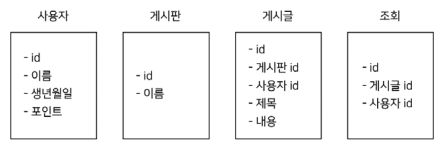
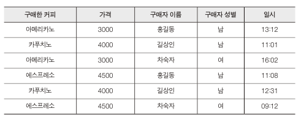
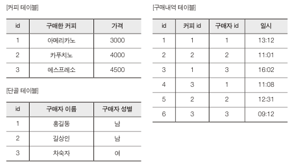
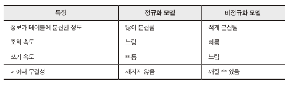

< 모두를 위한 PostgreSQL >을 공부하고 정리 했습니다. 

---

## 데이터 모델링
#### 예시
1. 사용자는 이름과 생년월일, 그리고 점수를 가진다
2. 게시판은 이름을 가진다.
3. 게시글은 사용자가 게시판에 작성 가능하고, 제목과 내용 조회수를 표시한다.
4. 조회수는 사용자당 1씩만 올릴 수 있고, 다시 게시글을 읽어도 조회수가 오르지 않는다.

- 게시판은 여러 개의 게시글을 가질 수 있고, 게시글은 하나의 게시판에 속해 있다.
    - 게시판과 게시글은 `일대다`관계
- 사용자는 여러 개의 게시글을 쓸 수 있고, 게시글에는 하나의 글쓴이가 있다.
    - 사용자와 게시글은 `다대다`관계
- 사용자는 여러 개의 게시글을 조회할 수 있고, 게시글은 여러 명의 사용자가 조회할 수 있다.
- 사용자는 하나의 점수를 갖고 점수는 하나의 사용자를 갖는다.
    - 사용자와 점수는 `일대일`관계

## 정규화와 비정규화
- `정규화`란 데이터의 중복성을 제거하거나 줄이기 위해 데이터를 구성하는 과정

### 정규화 되지 않은 스프레드 시트

- 단점
    - 중복된 정보가 많아서 데이터가 비효율적으로 많이 저장됨
    - 중복된 정보 사이에 실수로 오류가 발생할 확률 존재함
    - 특정 구매 이력의 고유 값이 없어서 어떤 내역을 간단하게 특정지을 수 없다.
### 정규화

### 비정규화를 하는 이유
- 여러 테이블을 `JOIN`하게 되면 성능이 느려질 수 있다.

## 인덱싱